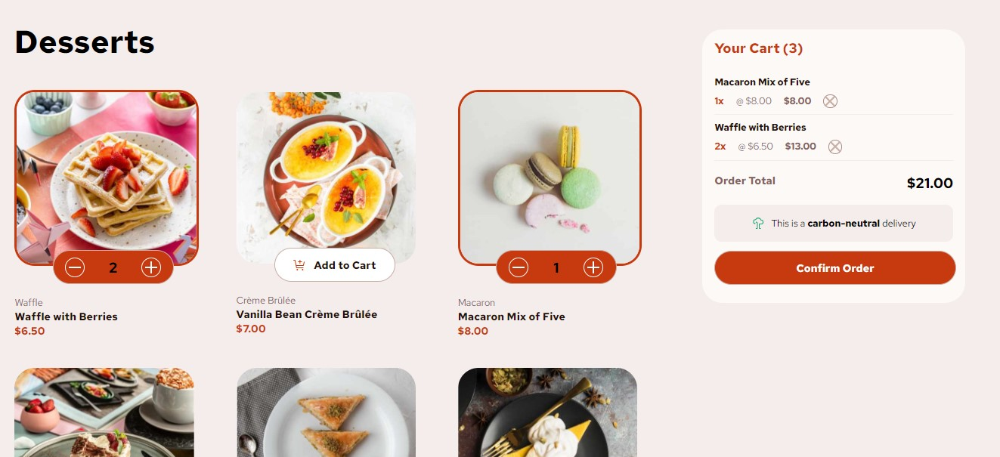

# Frontend Mentor - Product list with cart solution

This is a solution to the [Product list with cart challenge on Frontend Mentor](https://www.frontendmentor.io/challenges/product-list-with-cart-5MmqLVAp_d). Frontend Mentor challenges help you improve your coding skills by building realistic projects. 

## Table of contents

- [Overview](#overview)
  - [The challenge](#the-challenge)
  - [Screenshot](#screenshot)
  - [Links](#links)
- [My process](#my-process)
  - [Built with](#built-with)
  - [What I learned](#what-i-learned)
  - [Continued development](#continued-development)
- [Author](#author)

## Overview

### The challenge

Users should be able to:

- Add items to the cart and remove them
- Increase/decrease the number of items in the cart
- See an order confirmation modal when they click "Confirm Order"
- Reset their selections when they click "Start New Order"
- View the optimal layout for the interface depending on their device's screen size
- See hover and focus states for all interactive elements on the page

### Screenshot

### Links

- Solution URL: [MachadoA/product-list-with-cart](https://github.com/MachadoA/product-list-with-cart)
- Live Site URL: [Add live site URL here](https://your-live-site-url.com)

## My process

### Built with

- CSS custom properties
- Flexbox
- CSS Grid
- Mobile-first workflow
- [React](https://reactjs.org/) - JS library

### What I learned

Initially, I worked with prop drilling to pass data between components. However, upon finalizing the project, I preferred to use the useContext hook for state management and data sharing across components. This approach simplified the codebase, improved readability, and made state management more efficient.

### Continued development

The next step will be to replace useContext with Redux for more scalable and robust state management. Additionally, I plan to integrate a database to persist data, ensuring that the application maintains data consistency and allows for better data handling and retrieval.

## Author

- Website - [Ana Amaral](https://anaamaral.netlify.app/)
- Frontend Mentor - [@MachadoA](https://www.frontendmentor.io/profile/MachadoA)

